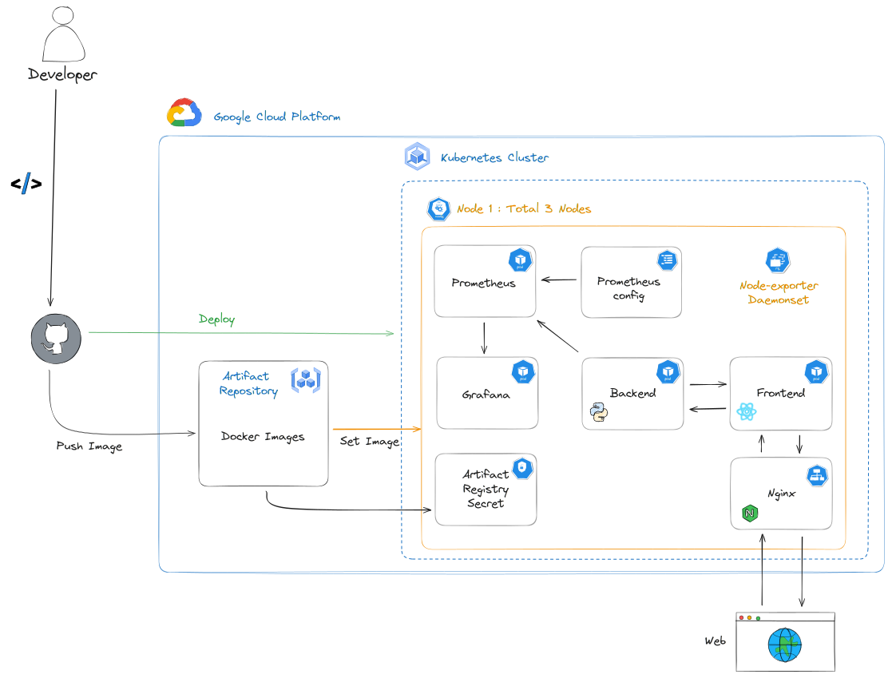

# Software Lifecycle

Welcome to my project! This initiative is designed to showcase the entire software development lifecycle, from code creation to deployment in Kubernetes. By embracing DevOps culture, my aim is to establish environments for continuous integration, delivery, deployment, and monitoring. This project serves as a comprehensive example of modern DevOps practices, providing hands-on experience with tools and methodologies that streamline and enhance the software development process.

# Diagram



# How to test the application?

We got the following external IP:PORTS for accesing the following services

```
1. NGINX = 34.82.239.155:80
2. PROMETHEUS = 34.145.61.71:9090
3. GRAFANA = 35.197.123.94:3000
```

You can log into Grafana with the following credentials

```
user=aadmin
pw=admin
```

Grafana is already connected with prometheus so that you can add a new data source and select the prometheus. After that, import a dashboard with the following ID=1860. This will display a full dashboard with cluster related metrics.

There are some endpoints you can access in the application.

```
34.82.239.155:80/ready
34.82.239.155:80/api/avatar
34.82.239.155:80/api/avatar/spec
```

Have fun!

# Test it out in your own minikube cluster!

Depending on your OS, you can install minikube in order to get a local kubernetes cluster in your machine. After setting up your minikube cluster and kubectl, you can test the application by executing the following command.

```
minikube start --driver=docker
kubectl apply -f manifests/
minikube service nginx
```