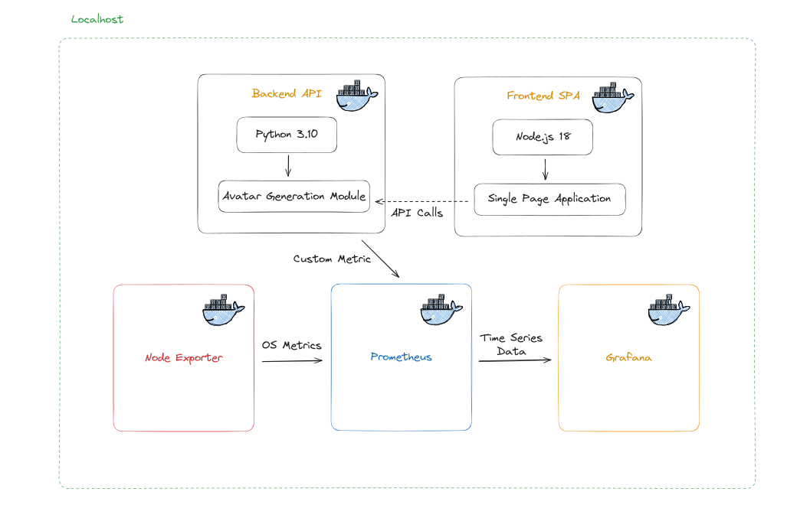

# Software Lifecycle

Welcome to my project! This initiative is designed to showcase the entire software development lifecycle, from code creation to deployment in Kubernetes. By embracing DevOps culture, my aim is to establish environments for continuous integration, delivery, deployment, and monitoring. This project serves as a comprehensive example of modern DevOps practices, providing hands-on experience with tools and methodologies that streamline and enhance the software development process.

# Try it out with docker-compose

After cloning the project, you can launch the application locally by doing a

```
    docker-compose build
    docker-compose up -d
```

Reading the Dockerfiles gives you an ingisht on the ports that are being used for the different services.

# Try it out with minikube cluster

Depending on your OS, you can install minikube in order to get a local kubernetes cluster in your machine. After setting up your minikube cluster and kubectl, you can test the application by executing the following command.

```
    minikube start --driver=docker
    kubectl apply -f minikube-manifests/
    minikube service nginx
```

This last command will create a tunel into your web browser for displaying and connecting the app.

# Diagram

This is a diagram that shows how the different modules communicate each other.

